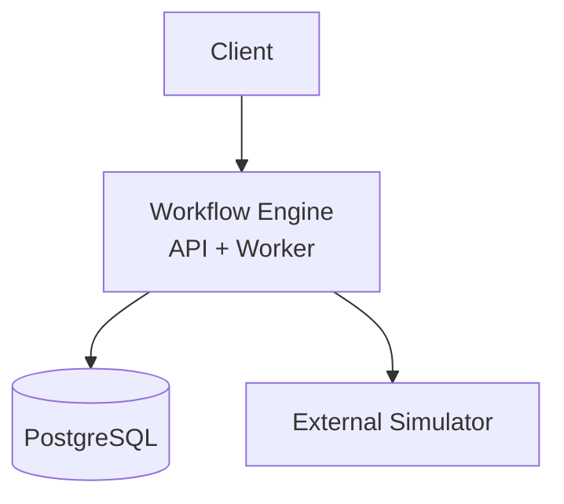
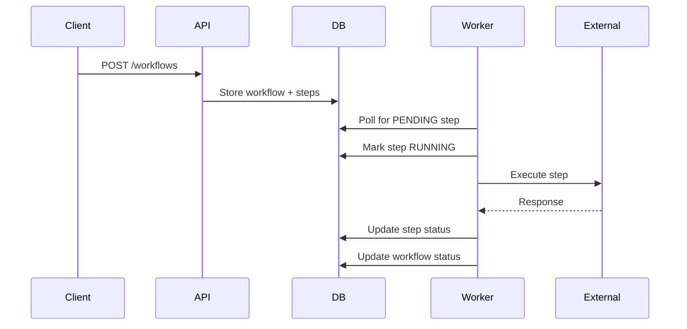

# Workflow System

A reliability-first workflow orchestration engine built incrementally to explore distributed systems concepts.

The project evolves through multiple versions:

- V1 — naive polling worker
- V2 — lease-based execution (crash recovery)
- V3 — retries and idempotency
- V4 — multi-worker coordination
- V5 — throughput scaling
- V6 — production observability

Each version introduces a new reliability improvement.

## Architecture

workflow-engine  
external-simulator  
PostgreSQL

## Tech Stack

Java 21  
Spring Boot  
PostgreSQL  
Flyway  
Docker

## Motivation

Most backend tutorials skip the **failure scenarios** of distributed systems.  
This project intentionally starts naive and evolves through real-world problems.

## System Architecture

## Workflow Execution

